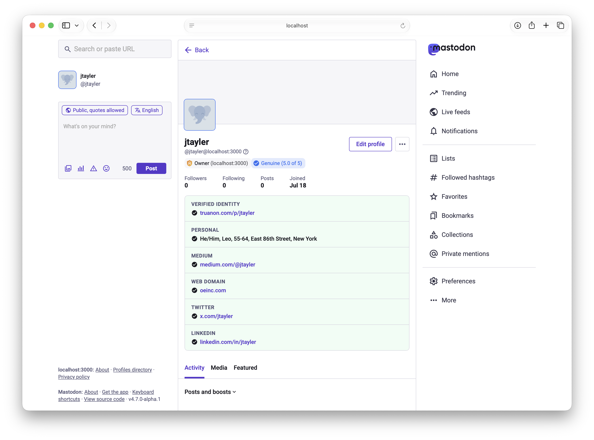
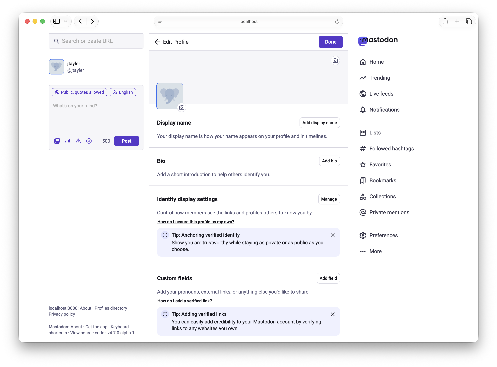
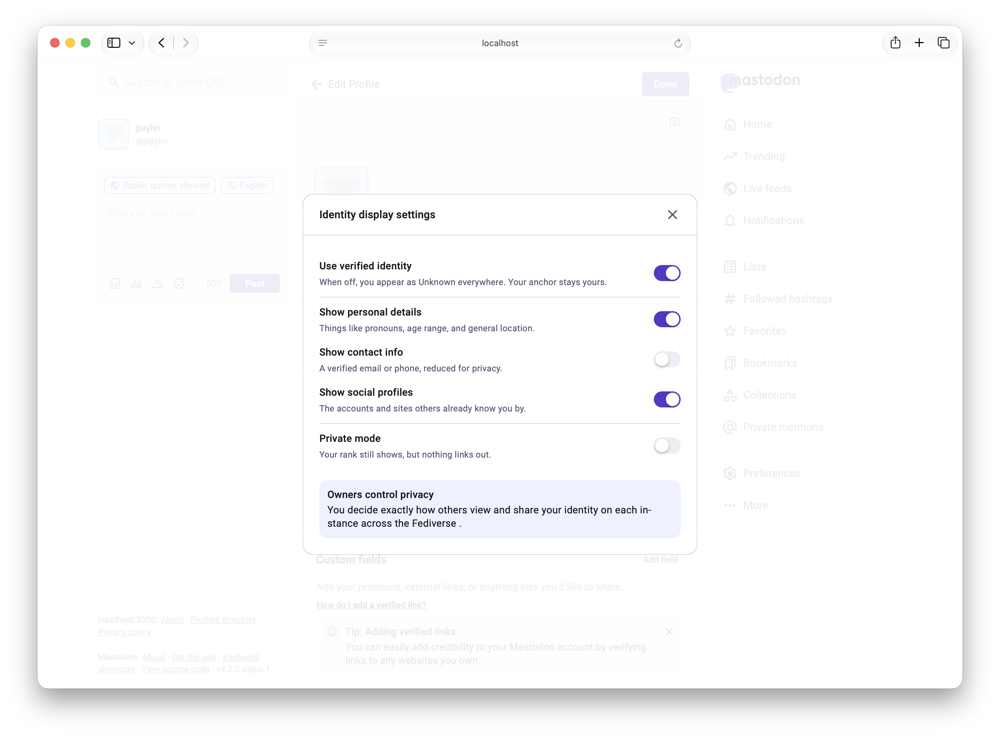
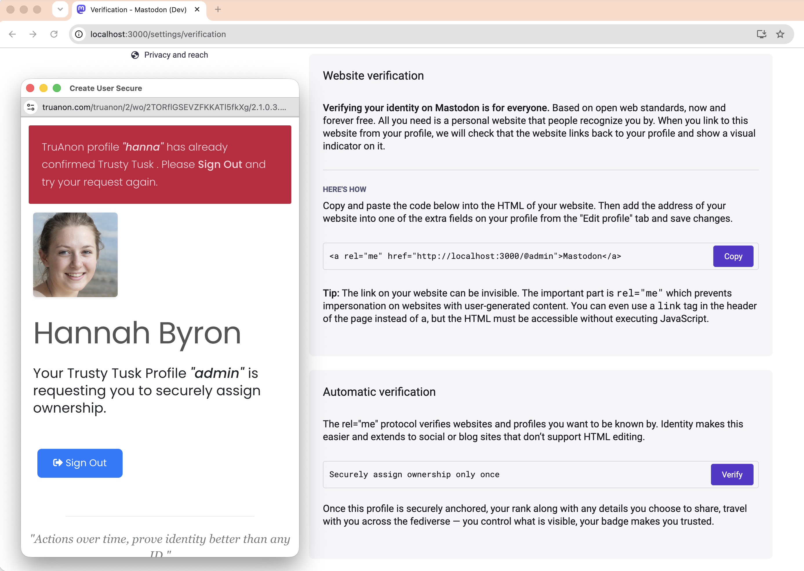
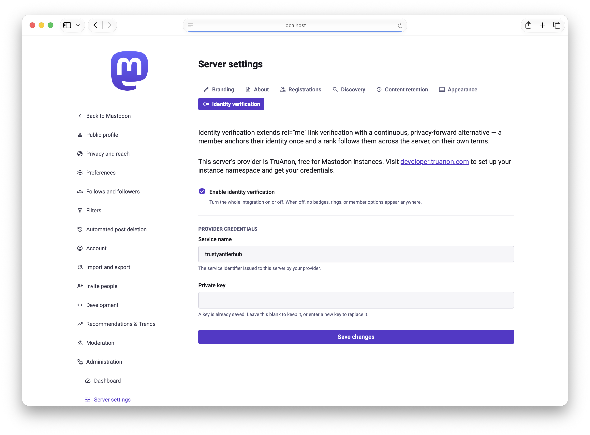

# Identity verification — what's actually in this branch

An extension to Mastodon's manual `rel="me"` link verification, built as a
pluggable provider rather than a single hardcoded integration:

- **`app/services/identity_verification_provider.rb`** — the abstract
  contract (`configured?`, `active?`, `badge_data`, `card_data`,
  `resolve_verification`, `refresh_cache!`). A second provider implements
  this and gets registered in one place.
- **`app/services/identity_verification.rb`** — the resolver every
  controller, worker, and serializer calls through.
- **`app/services/tru_anon_service.rb`** — the reference implementation,
  using [TruAnon](https://developer.truanon.com)'s API. Free for Mastodon
  instances.

## Where to look

- Badge + avatar ring: `app/javascript/mastodon/components/account_header/`,
  `app/javascript/mastodon/components/avatar.tsx`
- Member switches: Edit Profile section and `Settings → Verification`, both
  reading/writing the same `user.settings`
- Admin config: `Server Settings → Identity verification` — a real
  enable/disable switch, inert until a provider is configured
- Migration: `db/migrate/20260719193000_add_truanon_badge_to_accounts.rb`

## Privacy model

The server caches exactly two things: **rank** and **score**. Never a link,
never a property. Everything a member has granted visibility to is fetched
live per view and discarded after rendering. Turning verification off
doesn't erase the anchor — it returns display to `Unknown`, reversibly.

## Try it

Clone this branch, add `TRUANON_SERVICE_NAME` and `TRUANON_PRIVATE_KEY`
(from Server Settings once running, or as env vars), and every piece above
is live against a standard Mastodon dev setup. No public demo instance yet.

## Screenshots

Edit Profile — the entry point to the member's own identity display settings.

The Manage modal — per-field visibility switches, all reversible.

Settings → Verification — automatic verification sitting next to Mastodon's own manual `rel="me"` flow, not replacing it. This is the pitch in one screenshot.

Server Settings → Identity verification — admin-side enable switch and provider credentials.
